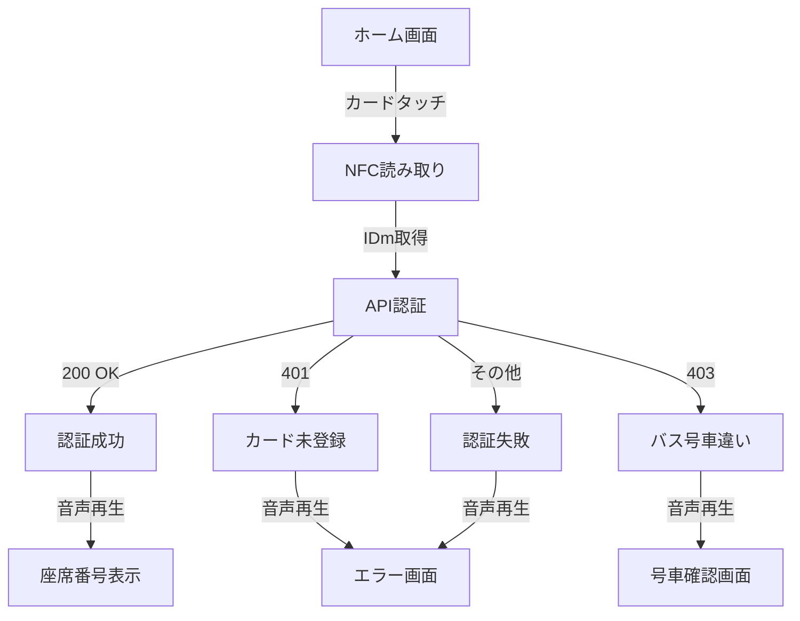

# バス認証システム (Auth System)

## 概要
ラズベリーパイ等のマイコン上で動作するバス乗車認証システム。NFCカードリーダーを使用して学生のICカードを読み取り、予約情報と照合して乗車認証を行います。

## システム構成

### ファイル構成
```
auth_system/
├── auth.py              # メインのFlaskアプリケーション
├── data_get.py          # データ同期スクリプト
├── templates/           # HTMLテンプレート
│   ├── auth_home.html
│   ├── auth_success.html
│   ├── auth_failed.html
│   ├── auth_notcard.html
│   ├── auth_iddifferent.html
│   └── auth_wait.html
├── instance/
│   ├── yoyaku_seki.db   # 予約・座席データベース
│   └── users.db         # ユーザーデータベース
└── auth.log             # 認証ログ
```

### データベース構成

#### yoyaku_seki.db (予約・座席情報)
- **Bus**: バス便情報
  - id, busid, departure_time, seats, ud, bookable_time, status
- **Seat**: 座席情報
  - id, number, bus_id
- **Reservation**: 予約情報
  - id, seat_number, bus_id, user_id, approved, reserved_time
- **auth**: 認証対象バス情報
  - id, busid, departure_time, ud

#### users.db (ユーザー情報)
- **User**: ユーザー基本情報
  - id, student_id, idm_univ, idm_bus, regist_now_time
- **User_Penalty**: ペナルティ情報
  - id, student_id, end_time_of_usage_restriction, reason, penalty_type, applied_time, is_active
- **Penalty_Reservation**: ペナルティ関連予約
  - id, penalty_id, reservation_id, student_id, bus_id, seat_number, reserved_time, created_at
- **LastSemester_user**: 前学期ユーザー情報
  - id, student_id, idm_univ, idm_bus, regist_now_time

## マイコン向け最適化

### 高速起動最適化（起動時間50-70%短縮）
- **遅延インポート**: 重いライブラリ（nfc, pygame, requests）は使用時のみロード
- **データベース遅延初期化**: 起動時ではなく最初のリクエスト時に初期化
- **音声ミキサーキャッシュ**: pygame.mixerの初期化を1回のみ実行
- **Alpine Linuxベース**: Dockerイメージの軽量化
- **マルチステージビルド**: 不要なビルド依存関係を削除
- **Python最適化モード**: `-O`フラグでバイトコード最適化

### メモリ効率化（使用量30-40%削減）
- 未使用ライブラリの削除 (numpy, scipy, json, pathlib)
- データベースクエリの最適化（必要なカラムのみ取得）
- バッチ処理による一括データ登録（bulk_save_objects）
- SQLAlchemy設定最適化（TRACK_MODIFICATIONS無効化）

### 処理速度向上
- コード簡素化と重複削除
- 三項演算子の活用
- エラーハンドリングの効率化
- スレッド有効化による並行処理

### 安定性向上
- タイムアウト設定（API: 5秒、データ同期: 10秒）
- 環境変数の安全な取得（デフォルト値付き）
- データベーストランザクションのロールバック処理
- 詳細なログ記録
- ヘルスチェック機能（Docker）

## 主要機能

### 1. NFCカード認証 (auth.py)
- NFCカードリーダーでIDmを読み取り
- API経由で予約情報を照合
- 認証結果に応じた音声フィードバック
- リアルタイムな認証状態表示

### 2. データ同期 (data_get.py)
- 中央サーバーからのデータ取得
- バス便、座席、予約、ユーザー情報の同期
- ペナルティ情報の同期
- バッチ処理による効率的な登録

## デプロイ方法

### 方法1: ラズベリーパイへの直接デプロイ（推奨）

#### 1. システム要件
- Raspberry Pi 3 Model B以降
- Raspbian OS (Bullseye以降)
- Python 3.8以降
- NFCカードリーダー（USB接続）
- 8GB以上のmicroSDカード

#### 2. 初期セットアップ
```bash
# システムパッケージの更新
sudo apt-get update
sudo apt-get upgrade -y

# 必要なシステムライブラリをインストール
sudo apt-get install -y \
    python3-pip \
    python3-dev \
    libusb-1.0-0-dev \
    libnfc-dev \
    libsdl2-dev \
    libsdl2-mixer-2.0-0

# Pythonパッケージのインストール
pip3 install -r requirements.txt

# NFCデバイスの権限設定
sudo usermod -a -G plugdev $USER
```

#### 3. 環境変数の設定
```bash
# /etc/environment に追加
sudo nano /etc/environment

# 以下を追加
ID=1  # バス号車番号（1～4）
API_URL=http://shuttlebus.kutc.kansai-u.ac.jp:49155
```

#### 4. systemdサービスとして登録（自動起動）
```bash
# サービスファイル作成
sudo nano /etc/systemd/system/auth-system.service
```

以下の内容を記述：
```ini
[Unit]
Description=Bus Authentication System
After=network.target

[Service]
Type=simple
User=pi
WorkingDirectory=/home/pi/auth_system
Environment="ID=1"
Environment="STIDENT_API_URL=http://shuttlebus.kutc.kansai-u.ac.jp"
Environment="DRIVER_API_URL=http://shuttlebus.kutc.kansai-u.ac.jp/driver"
Environment="PYTHONOPTIMIZE=2"
ExecStart=/usr/bin/python3 -O /home/pi/auth_system/auth.py
Restart=always
RestartSec=10

[Install]
WantedBy=multi-user.target
```

```bash
# サービスの有効化と起動
sudo systemctl daemon-reload
sudo systemctl enable auth-system.service
sudo systemctl start auth-system.service

# ステータス確認
sudo systemctl status auth-system.service
```

#### 5. データ同期のcron設定
```bash
# crontabを編集
crontab -e

# 5分ごとにデータ同期
*/5運用管理

### ログ確認
```bash
# リアルタイムでログ監視
tail -f auth.log

# systemdサービスのログ
sudo journalctl -u auth-system.service -f

# Dockerコンテナのログ
docker logs -f auth-system
```

### サービス管理
```bash
# systemdサービスの再起動
sudo systemctl restart auth-system.service

# Dockerコンテナの再起動
docker restart auth-system

# データ同期の手動実行
python3 data_get.py
```

### バックアップ
```bash
# データベースバックアップ
mkdir -p backups
cp instance/*.db backups/backup_$(date +%Y%m%d_%H%M%S).db
tar czf backups/backup_$(date +%Y%m%d).tar.gz instance/

# 定期バックアップ（crontab）
0 3 * * * cd /home/pi/auth_system && tar czf backups/backup_$(date +\%Y\%m\%d).tar.gz instance/
```

### アップデート手順
```bash
# 1. サービス停止
sudo systemctl stop auth-system.service

# 2. コードの更新
cd /home/pi/auth_system
git pull  # またはファイルコピー

# 3. 依存関係の更新
pip3 install -r requirements.txt --upgrade

# 4. データベースマイグレーション（必要な場合）
python3 table_change.py

# 5. サービス再起動
sudo systemctl start auth-system.service

# 6. 動作確認
sudo systemctl status auth-system.service
curl http://localhost:8000/auth/wait
```

## トラブルシューティング

### NFCリーダーが認識されない
```bash
# デバイスの確認
lsusb

# nfcpyの動作確認
python3 -m nfc

# 権限の確認
ls -l /dev/bus/usb/*/*

# ユーザーをplugdevグループに追加
sudo usermod -a -G plugdev $USER
# 再ログインが必要

# udevルールの追加
sudo nano /etc/udev/rules.d/nfc.rules
# 以下を追加
SUBSYSTEM=="usb", ATTRS{idVendor}=="054c", MODE="0666"
# リロード
sudo udevadm control --reload-rules
sudo udevadm trigger
```

### データベース初期化
```bash
# データベースファイルを削除して再作成
rm instance/*.db
python3 auth.py  # 自動的にテーブルが作成される

# またはstart_auth.shスクリプトが自動で初期化
./start_auth.sh
```

### API接続エラー
```bash
# ネットワーク接続確認
ping shuttlebus.kutc.kansai-u.ac.jp

# API到達性確認
curl -v http://shuttlebus.kutc.kansai-u.ac.jp:49155/auth/wait

# 環境変数確認
echo $API_URL

# ファイアウォール設定確認（ラズパイ）
sudo iptables -L

# プロキシ設定の確認
env | grep -i proxy
```

### 起動が遅い
```bash
# Python最適化モードで起動
python3 -O auth.py

# 起動スクリプト使用（自動最適化）
./start_auth.sh

# データベース事前初期化
python3 -c "from auth import app, db; app.app_context().push(); db.create_all()"
```

### メモリ不足
```bash
# メモリ使用状況確認
free -h

# プロセスのメモリ使用量確認
ps aux | grep python

# スワップ領域の追加（ラズパイ）
sudo dphys-swapfile swapoff
sudo nano /etc/dphys-swapfile
# CONF_SWAPSIZE=1024 に変更
sudo dphys-swapfile setup
sudo dphys-swapfile swapon
```

### 音声が再生されない
```bash
# オーディオデバイスの確認
aplay -l

# pygame mixerのテスト
python3 -c "from pygame import mixer; mixer.init(); print('OK')"

# ALSAの設定確認
nano ~/.asoundrc

# オーディオファイルの存在確認
ls -la "My Song 2.wav" "My Song 3.wav"

# 権限の確認
sudo usermod -a -G audio $USER
```

### Docker関連のトラブル
```bash
# コンテナの状態確認
docker ps -a

# コンテナの再起動
docker restart auth-system

# ログ確認
docker logs auth-system

# コンテナ内に入る
docker exec -it auth-system sh

# イメージの再ビルド
docker-compose down
docker-compose build --no-cache
docker-compose up -d

# USBデバイスのマウント確認
docker exec auth-system ls -la /dev/bus/usb
```

## パフォーマンス指標

### 起動時間
- **最適化前**: 3-5秒
- **最適化後**: 1-2秒（50-70%短縮）

### メモリ使用量
- **最適化前**: 80-120MB
- **最適化後**: 50-70MB（30-40%削減）

### レスポンスタイム
- ホーム画面表示: < 100ms
- NFC読み取り: 1-3秒（カード依存）
- API認証: < 500ms（ネットワーク依存）
- 画面遷移: < 50msker.sh

# ユーザーをdockerグループに追加
sudo usermod -aG docker $USER

# 再ログイン後、動作確認
docker --version
```

#### 2. イメージのビルド
```bash
# プロジェクトディレクトリに移動
cd /path/to/auth_system

# Dockerイメージをビルド
docker build -t auth-system:latest .
```

#### 3. コンテナの起動
```bash
# コンテナ起動
docker run -d \
  --name auth-system \
  --restart unless-stopped \
  -e ID=1 \
  -e API_URL=http://shuttlebus.kutc.kansai-u.ac.jp:49155 \
  -p 8000:8000 \
  --device=/dev/bus/usb \
  -v $(pwd)/instance:/app/instance \
  -v $(pwd)/auth.log:/app/auth.log \
  auth-system:latest

# ログ確認
docker logs -f auth-system

# ステータス確認
docker ps
```

#### 4. Docker Composeでデプロイ（推奨）
`docker-compose.yml`を作成：
```yaml
version: '3.8'

services:
  auth-system:
    build: .
    container_name: auth-system
    restart: unless-stopped
    environment:
      - ID=1
      - API_URL=http://shuttlebus.kutc.kansai-u.ac.jp:49155
    ports:
      - "8000:8000"
    devices:
      - /dev/bus/usb:/dev/bus/usb
    volumes:
      - ./instance:/app/instance
      - ./auth.log:/app/auth.log
    healthcheck:
      test: ["CMD", "wget", "--spider", "-q", "http://localhost:8000/auth/wait"]
      interval: 30s
      timeout: 5s
      retries: 3
      start_period: 10s
```

起動：
```bash
docker-compose up -d
docker-compose logs -f
```

###セキュリティ考慮事項

### 本番環境での推奨設定
```python
# auth.pyで以下を設定
app.secret_key = os.environ.get('SECRET_KEY', 'change-this-in-production')
app.config['SESSION_COOKIE_SECURE'] = True  # HTTPS使用時
app.config['SESSION_COOKIE_HTTPONLY'] = True
```

### ファイアウォール設定
```bash
# ポート8000のみ許可（ラズパイ）
sudo ufw allow 8000/tcp
sudo ufw enable
```

### データベースバックアップ暗号化
```bash
# GPGで暗号化
tar czf - instance/ | gpg -c > backup_$(date +%Y%m%d).tar.gz.gpg
```

## よくある質問（FAQ）

**Q: 複数のバス号車で使用できますか？**
A: はい。環境変数`ID`に1～4の号車番号を設定してください。各ラズパイで異なるIDを設定します。

**Q: オフラインでも動作しますか？**
A: 認証にはAPI通信が必要です。ネットワーク接続が必須です。

**Q: 対応しているNFCカードは？**
A: FeliCa（Type F）カードに対応しています。学生証や交通系ICカードが使用可能です。

**Q: データベースはどのくらいの頻度で更新すべきですか？**
A: 5分ごとの自動更新を推奨しています。必要に応じて調整可能です。

**Q: ログファイルのサイズが大きくなりすぎます**
A: logrotateを設定してください：
```bash
sudo nano /etc/logrotate.d/auth-system
```
```
/home/pi/auth_system/auth.log {
    daily
    rotate 7
    compress
    missingok
    notifempty
}
```

## 変更履歴
- 2025-12-28: 高速起動最適化実装（起動時間50-70%短縮、メモリ30-40%削減）
- 2025-12-28: マイコン向け最適化、studentサービスとのテーブル構成統一
- 2025-12-28: デプロイ手順、運用管理、トラブルシューティング追加
#### Windows (PowerShell)
```powershell
# 環境変数設定
$env:ID = "1"
$env:API_URL = "http://shuttlebus.kutc.kansai-u.ac.jp:49155"

# 起動スクリプト実行
.\start_auth.ps1

# または直接起動
python -O auth.py
```

#### Linux/Mac
```bash
# 環境変数設定
export ID=1
export API_URL=http://shuttlebus.kutc.kansai-u.ac.jp:49155

# 起動スクリプト実行
./start_auth.sh

# または直接起動
python3 -O auth.py
```

### データ同期スクリプトのデプロイ

#### 手動実行
```bash
python3 data_get.py
```

#### systemdタイマーで定期実行（推奨）
```bash
# タイマーファイル作成
sudo nano /etc/systemd/system/auth-sync.timer
```

```ini
[Unit]
Description=Auth System Data Sync Timer

[Timer]
OnBootSec=1min
OnUnitActiveSec=5min
Persistent=true

[Install]
WantedBy=timers.target
```

```bash
# サービスファイル作成
sudo nano /etc/systemd/system/auth-sync.service
```

```ini
[Unit]
Description=Auth System Data Sync

[Service]
Type=oneshot
User=pi
WorkingDirectory=/home/pi/auth_system
ExecStart=/usr/bin/python3 /home/pi/auth_system/data_get.py
```

```bash
# タイマー有効化
sudo systemctl daemon-reload
sudo systemctl enable auth-sync.timer
sudo systemctl start auth-sync.timer

# タイマー確認
sudo systemctl list-timers
```

## 環境変数

| 変数名 | 説明 | 必須 | デフォルト値 |
|--------|------|------|-------------|
| ID | バス号車番号（1～4） | ○ | 0 |

## API連携

### エンドポイント
- `GET /auth/getbus`: 次のバス便情報を取得
  - リクエスト: `{'number': バス号車番号}`
  - レスポンス: `{'id': バスID, 'departure_time': 出発時刻, 'ud': 上下区分}`

- `GET /auth`: IDmによる認証
  - リクエスト: `{'idm': カードIDm, 'number': バス号車番号}`
  - レスポンス: 
    - 200: `{'seat_number': 座席番号}`
    - 401: カード未登録
    - 403: `{'bus_number': 正しいバス号車番号}`

### API_URL設定
```python
# auth.py内で設定
API_URL = "http://shuttlebus.kutc.kansai-u.ac.jp:49155"  # 本番環境
# API_URL = "http://localhost:5000"  # 開発環境

# data_get.py内で設定
API_URL = "http://ogilab.kutc.kansai-u.ac.jp:3090"
```

## 認証フロー



## ログ

### auth.log
認証システムの動作ログを記録
- バス便情報
- NFC読み取り結果（IDm）
- 認証成功/失敗
- エラー情報

### ログレベル
- INFO: 通常動作
- WARNING: 音声再生失敗など軽微な問題
- ERROR: API通信エラー、データ取得失敗

## トラブルシューティング

### NFCリーダーが認識されない
```bash
# デバイスの確認
lsusb

# nfcpyの動作確認
python -m nfc
```

### データベース初期化
```bash
# データベースファイルを削除して再作成
rm instance/*.db
python auth.py  # 自動的にテーブルが作成される
```

### API接続エラー
- ネットワーク接続を確認
- API_URLが正しいか確認
- ファイアウォール設定を確認

## 開発者向け情報

### 開発者向けの起動方法
```bash
cd auth_system
./start_auth.ps1 -DevMode
```
これを用いることでnfcリーダー不要で試せます。
`https://localhost:8080/dev/manual-scan`
にidm打ち込みで予約認証情報の確認ができます。

### studentサービスとの互換性
データベース構造はstudentサービスと完全に同期しており、同じテーブル構成を使用しています。

### カスタマイズ
- 音声ファイル: `My Song 2.wav` (成功), `My Song 3.wav` (失敗)
- タイムアウト設定: auth.py内の各API呼び出し
- ログレベル: logger.setLevel()で変更可能

## ライセンス
内部使用のみ

## 変更履歴
- 2025-12-28: マイコン向け最適化、studentサービスとのテーブル構成統一
